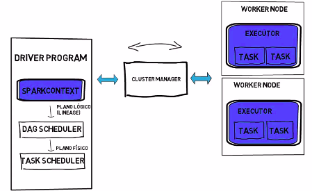
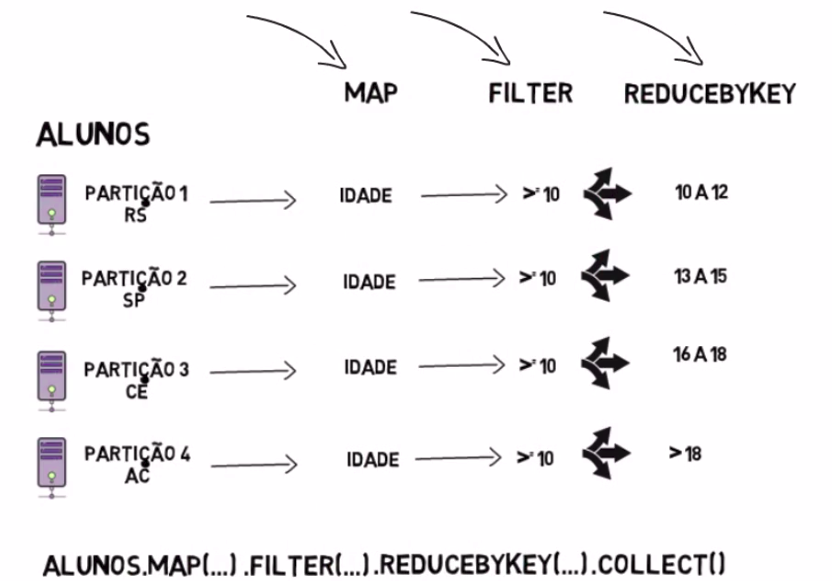

# Spark

É uma plataforma analítica unificada para o processamento de dados em larga escala. Ou seja, o Spark pode ser utlizado em vários use cases distintos sem precisar combinar ferramentas para resolver problemas diferentes. Em geral, o Apache Spark é utilizado em use case analítico:

<ul>
  <li>Preparar dados para nálise</li>
  <li>Criar modelos de ML</li>
  <li>Analisar dados em tempo real</li>
</ul>

Um breve resumo do funcionamento
================================

Driver Program é o responsável por orquestra a execução do programa. É a função Main onde está toda a lógica de execução do código. Possui um tamanho de memória alocada então é importante ficar atento para que não haja estouro de meória.

Lembre-se que a finalidade é executar tarefas de forma distribuída, portanto, a arquitetura possui o SparkContext que faz a ponte entre o driver program e o ambiente de execução da tarefa. Isso permite a execução distribuída em outro local que são definidos pelos executors. Portanto, o spark context faz uma conexão entre o driver e os executors. Pode ser configurado no sparkcontext o quanto de memória a ser utilizado ou o número de executors que é a quantidade de threads alocadas.

Todas as operações serão traduzidas para um plano de execução lógico conhecido como Lineage que é bastante similar aos encontrados nos bancos de dados relacionais (load, filter, return). Conhecendo a sequência lógica, o Spark cria o DAG Scheduler que é a sequência lógica quebrada por estágios ou stages do inglês. Conhecido os stages então finalmente o consegue criar as tarefas que serão executadas (Task Schedule).

Os Worker Node onde estão os Executors são os responsáveis por executar as tarefas, parametrizadas no driver program, de forma distribuída. Como estamos falando de execução distribuída é muito comum ter mais de um worker node envolvido na resolução de problemas que fazem do Spark como solução. 

Portanto entre o driver program e os worker nodes existe um cluster manager que faz a gestão dos recursos: memória e CPU, alocados nos worker nodes. O cluster manager pode ser do próprio Spark ou ferramenta de outro fornecedor, por exemplo: Yarn. Fazendo uso ou não do cluster manager, é importante saber o local onde o driver program irá rodar, e isso é definido pelo modo de execução do Spark.

No modo Standalone, o spark executa em uma única máquina e não utiliza o cluster manager. Neste modo também não há a figura do work node e todo processamento é feito em uma única máquina. Ainda assim é possível distribuir processamento pelo processador.

No modo client mode, o driver program roda na mesma máquina em que o programa foi iniciado.

No modo cluster mode, o driver program roda em qualquer máquina do cluster.

Entretanto, o principal componente do Spark são os RDD (Resilient Distributed Dataset) que são coleções de objetos particionadas em várias máquinas do cluster e podem ser processadas em paralelo. É a estrutura onde os dados são carregados e distribuídos em diferentes máquinas. São por definição, IMUTÁVEIS e pode-se fazer duas operações com os RDD: transformações e ações. As transformações não são processadas no momento em que o comando é executado. Lembre-se: RDD são IMUTÁVEIS. Portanto, uma transformação de uma nova coluna é criar um novo RDD. As transformações serão executadas SOMENTE quando uma operação de ação for encontrada.

Portanto, os RDDs devem conhecer suas listas de partições, possuir compute functions (action e transformation) e saber gerenciar as dependências de cálculo (DAG).
O DAG (Direct Acyclic Graph) é responsável por mapear todas as action e transformation do programa, bem como os stages e suas tasks.

Depois que uma operação é feita, a não ser que seja configurado pelo recurso de persistência, o Spark não deixará todos os RDDs em memória. Por padrãoo Spark insere no cache dados intermediários quando uma tarefa é finalizada essa operação é conhecida como resultado da stage.

<table border=0 align="center">
    <tr>
      <td colspan="2">
        
      </td>
    </tr>
</table>

Um plano de execução lógico só estará no Driver Program assim que executar um Action. Como no seguinte comando: ALUNOS.MAP(...).FILTER(...).REDUCEBYKEY(...).COLLECT(), onde a função COLLECT() é um Action. Portanto, até que o action seja executado, NADA estará no Driver Program.

<table border=0 align="center">
    <tr>
      <td colspan="2">
        
      </td>
    </tr>
</table>

E por meio de execução do plano físico que o Spark executa as tarefas do Driver Program. E como isso é feito? Para tal, é preciso conhecer os tipos de relacionamentos existente entre cada etapa da operação. Os relacionamento são classificados como: Narrow e Wide dependencies. Sempre há uma partição pai e uma filha envolvidas, portanto, é possível definir as partições da seguinte forma:

<ul>
  <li>Narrow Dependency: A partição filha depende de todos os dados da partição pai MESMO SE a partição pai entregar todos os seus dados para outra partição filha.</li>
  <li>Na Wide Dependency: A partição filha depende de uma parte de cada partição pai.</li>
</ul>

Portanto, a partir do conceito de narrow e wide, a tasks MAP e FILTER da imagem acima são narrow enquanto a task REDUCEBYKEY é wide. O ponto que divide as tarefas narrow e wide é chamado de shift e nesse ponto o spark quebra em stages diferentes. Essa operação é conhecida como task boundary.

Road Map
========
<ul>
  <li>Instalando e montando ambiente no Linux</li>
  <li>Configurando Apache Spark</li>
  <li>Como funciona a consulta de dados no Apache Spark usando Spark Dataframe (workload de dados e ETL) + Scala</li>
  <li>Spark Streaming (dados em tempo real), MLIB (ML) e GraphX (processamento de gráficos) na prática</li>
  <li>Aplicar Map Reduce</li>
  <li>E mais...</li>
</ul>

Instalando e montando ambiente no Linux:
========================================
Instalando com PyPi 
<a href="https://pypi.org/project/pyspark/">PySpark</a> está disponível em pypi. Para instalar execute o seguinte comando via terminal: pip install pyspark. Dica: Por mais que seja estável, não instale a última versão!
